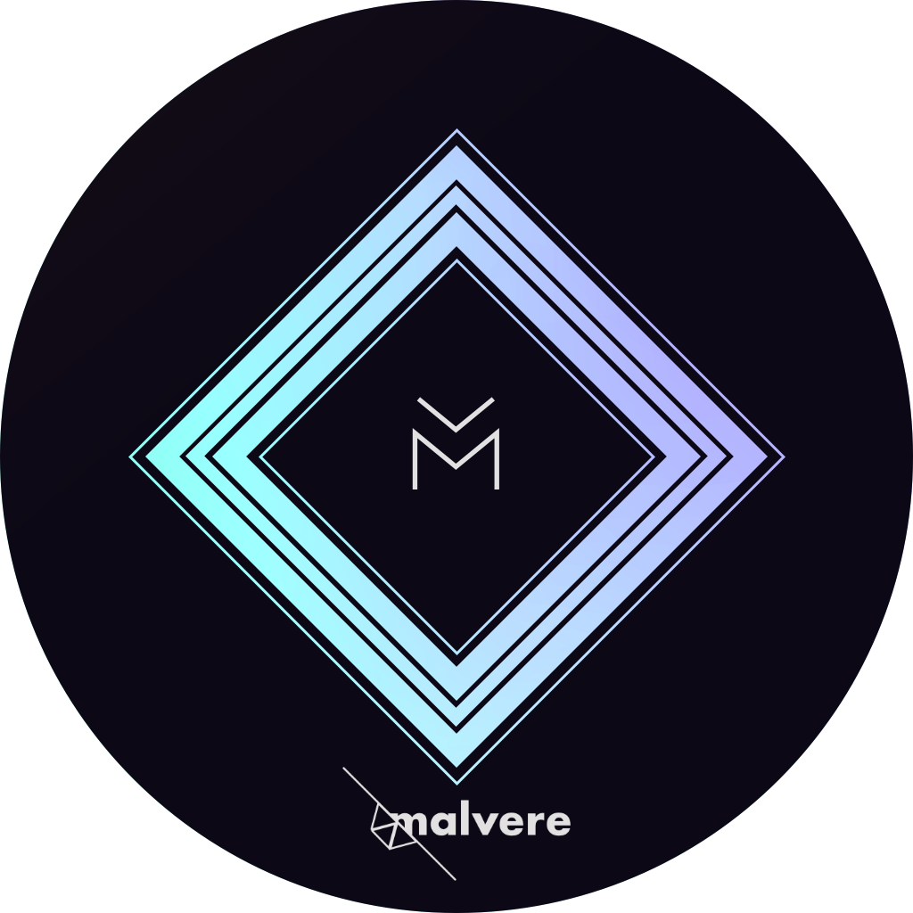

<h1 align="center">
   
  WarpDrive2
   
</h1>

  
  

 

  

This bot allows users to quickly generate WireGuard .conf files.
## Features
- Generates Warp License Keys (12PB)
- Generates basic and WarpPlus configs
- Ability to generate QR-Code for coresponding .conf
- Admin and member-only features
## Technologies Used
- aiogram
- asyncio
- httpx w/async
- wgcf
- aiofiles

## Improvements I'd make
- Some of Bot's components are still synchronous and they need to be rewritten
- DataBase implementation for the ability to track usage and
- Enhanced function restriction with Throttling to prevent spam
## Notes 
Not a Final build
